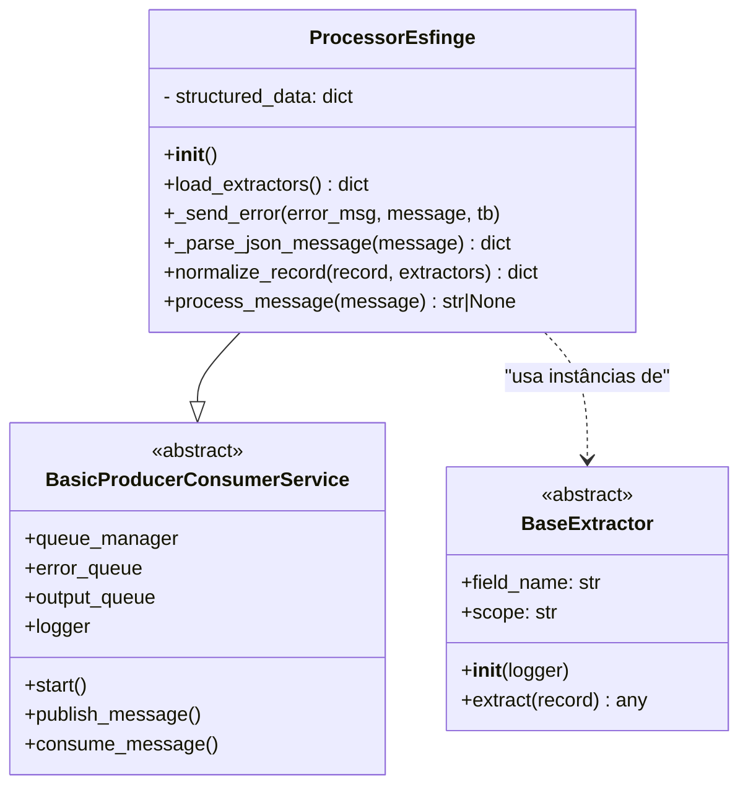

# Processor Esfinge

O `ProcessorEsfinge` é um módulo responsável por receber mensagens em formato JSON, aplicar processos de extração e normalização por meio de extractors especializados e publicar os resultados em filas de saída, com tratamento robusto de erros e logs detalhados.

Ele faz parte do pipeline de processamento de dados do projeto CEOS e segue o padrão produtor-consumidor herdado de `BasicProducerConsumerService`.

## Visão Geral
Este módulo implementa a lógica de extração de campos a partir de registros JSON brutos publicados pelo módulo Splitter do CEOS.
A extração é realizada de forma modular, por meio de classes chamadas `Extractors`, todas herdando de uma classe base comum (`BaseExtractor`).

## Diagrama de classes


### Explicação:

1. `ProcessorEsfinge` herda de `BasicProducerConsumerService`.

2. O atributo `structured_data` guarda os registros normalizados.

3. O método `load_extractors` percorre os módulos `extractors` e instancia classes que herdam de `BaseExtractor`.

## Funcionamento

Cada `extractor` é responsável por um único campo de saída.

O `extractor` busca a informação no JSON de entrada usando `message.get("chave")`.

Caso a chave *não exista* ou o valor seja *inválido*, o extractor retorna `None`.

O `ProcessorEsfinge` orquestra todos os `extractors`, executando-os em sequência e agregando os resultados em uma única saída estruturada.

Os valores `None` não são descartados nesta etapa: eles permanecem na saída e serão tratados no próximo módulo (Verifier).

### Fluxo Esperado

1. Mensagem JSON chega na fila de entrada.
2. ProcessorEsfinge lê e converte para dict.
3. Cada campo é tratado por seu extractor.
4. Resultado estruturado é publicado em fila de saída.
5. Erros, caso ocorram, são direcionados para fila de erros.


## Estrutura do Código

- BaseExtractor
    - Classe abstrata com a interface mínima para todos os extractors.

- ProcessorEsfinge

    - Responsável por carregar todos os extractors, aplicar em cada registro e montar a saída final:

- `load_extractors(self)`

    - Carrega dinamicamente todos os módulos dentro do diretório extractors/.

    - Identifica classes que herdam de BaseExtractor.

    - Retorna um dicionário de extractors indexado pelo field_name.

    **Comportamento esperado**:
Cada campo configurado em um extractor fica acessível dinamicamente.

    **Em caso de falha**:
Se um módulo não puder ser importado ou não contiver extractors válidos, o erro é logado, mas o serviço continua carregando os demais.

- `_send_error(self, error_msg, message, tb=None)`

    - Publica mensagens de erro na fila de erros (`error_queue`).

    - Inclui `error_msg`, `traceback` e o conteúdo da mensagem original.

    - Registra o erro no logger.

    **Comportamento esperado**:
Garantir rastreabilidade total de falhas.

    **Em caso de falha**:
Se não conseguir publicar na fila, o logger ainda registrará a ocorrência.

- `_parse_json_message(self, message)`

    - Converte a mensagem recebida para dicionário Python.

    - Aceita os seguintes tipos:

    - bytes → decodificado para str → convertido para dict

    - str → convertido para dict

    - dict → retornado diretamente

    **Comportamento esperado**:
Retornar um dicionário Python válido.

    **Em caso de falha**:

    - Mensagens inválidas disparam `TypeError`.

  - JSON malformado levanta `json.JSONDecodeError`.

- `normalize_record(self, record, extractors)`

  - Cria estruturas por escopo (ex.: ente, unidade_gestora, processo_licitatorio).

  - Aplica cada extractor ao registro.

  - Preenche `structured_data` com os valores extraídos.

  - Em caso de erro de extração, o campo recebe `None`.

  **Comportamento esperado**:
Retornar um dicionário hierárquico com os campos normalizados.

  **Em caso de falha**:
Erros de extração são logados como warnings, mas o processamento continua.

- `process_message(self, message)`

  - Fluxo principal de processamento:

  - Carrega os extractors (`load_extractors`).

  - Faz parse da mensagem (`_parse_json_message`).

  - Normaliza o registro (`normalize_record`).

  - Converte em JSON estruturado.

  - Publica na fila de saída (`output_queue`).

  **Comportamento esperado**:
Mensagem JSON bem estruturada enviada para a fila de saída.

  **Em caso de falha**:

  - Mensagens inválidas → enviadas para a fila de erros.

  - Erros inesperados → capturados e registrados com traceback.
### Formato de Entrada

O Processor recebe como entrada registros JSON brutos produzidos pelo Splitter, por exemplo:
```json
{
  "id inidoneidade": 10000001, 
  "id tipo pessoa": "ENUM", 
  "código cic": 19287841000150, 
  "nome pessoa": "HIGI PLUS DISTRIBUIDORA DE PRODUTOS", 
  "data publicação": "24/04/2017 00:00:00", 
  "data fim prazo": "24/04/2019 00:00:00", 
  "competencia": 201702, 
  "identificador tipo inidoneidade": "ENUM", 
  "raw_data_id": "68fd523612c588bf767749a2", 
  "entity_type": "inidoneidade", 
  "data_source": "esfinge", 
  "universal_id": "68fd523612c588bf767749a2"
}

```
### Formato de Saída

A saída é um dicionário estruturado por escopo (tabela de destino).
Cada campo extraído é atribuído ao seu respectivo escopo e field_name.

Exemplo de saída após implementação do `specific_fk_manager`:
```json
{
    "id empenho": 38160001,
    "num empenho": 1,
    "valor empenho": "1452,83",
    "descrição histórico empenho": "PAGAMENTO PARCELA FINANCIAMENTO PRO-MORADIA MORRO  AMANDIO.",
    "data empenho": "03/01/2005 00:00:00",
    "credor": "CAIXA ECONOMICA FEDERAL",
    "cnpj/cpf credor": 360305085266,
    "prestacaocontas?": 0,
    "regularizacaoorcamentaria?": 0,
    "id unidadeorcamentaria": 1,
    "nro. projetoatividade": 1,
    "detalhamentofonterecurso": null,
    "competência empenho": 200501,
    "id categoriaeconomicadespesa": 2,
    "id gruponaturezadespesa": 6,
    "id modalidadeaplicacao": 90,
    "id elementodespesa": 1,
    "id indicadoruso": 1,
    "id grupofontesrecursos": 1,
    "id especificacaofonterecurso": 0,
    "id tipoacao": 9,
    "id tipoempenho": 1,
    "id processolicitatorio": 32080001,
    "id tipopessoa (quem)": 2,
    "id subempenho": null,
    "id unidadegestora empenho": 1,
    "id detalhamentodestinacaorecurso": null,
    "id detalhamentoelementodespesa": 1,
    "nro. licitação": 6969696,
    "nro. contrato": 37050001,
    "nro. convênio": 21040001,
    "nro. contratosuperior": 37050001,
    "nro. conveniosuperior": 21040002,
    "raw_data_id": "690a245c0da109c7c9252370",
    "entity_type": "empenho",
    "data_source": "esfinge",
    "collect_id": "690a245c0da109c7c925236f",
    "raw_data_collection": "esfinge.empenho",
    "_id": "690a245c0da109c7c9252370",
    "unidade_gestora": {
        "raw_data_id": "690a243e0da109c7c9252349"
    },
    "unidade_orcamentaria": {
        "raw_data_id": "690a243e0da109c7c925234c"
    },
    "categoria_economica_despesa": {
        "raw_data_id": "690a243e0da109c7c9252322"
    },
    "elemento_despesa": {
        "raw_data_id": "690a243e0da109c7c925232a"
    },
    "processo_licitatorio": {
        "raw_data_id": "690a245c0da109c7c9252360"
    },
    "detalhamento_elemento_despesa": {
        "raw_data_id": "690a243e0da109c7c9252326"
    }
}
```


Exemplo de saída:
```json
 {
    "pagamento_empenho": {
        "id_subempenho_pagamento_empenho": null,
        "cod_banco": null,
        "data_publicacao_justificativa": null,
        "id_tipo_recurso_antecipado": null,
        "data_validade": null,
        "data_exigibilidade": null,
        "id_empenho": null,
        "competencia": 201702,
        "nro_conta_bancaria_pagadora": null,
        "nro_ordem_bancaria": null,
        "id_liquidacao": null,
        "valor_pagamento": null,
        "data_pagamento": null,
        "id_pagamento_empenho": null,
        "cod_agencia": null
    },
    "unidade_orcamentaria": {
        "id_unidade_orcamentaria": null,
        "nome_unidade_orcamentaria": null,
        "cod_unidade_orcamentaria": null
    },
    "item_licitacao": {
        "descricao_item_licitacao": null,
        "numero_sequencial_item": null,
        "descricao_unidade_medida": null,
        "tipo_item": null,
        "situacao_item": null,
        "valor_estimado_item": null,
        "qtd_item_licitacao": null,
        "id_processo_licitatorio": null,
        "id_item_licitacao": null,
        "competencia": 201702,
        "data_homologacao": null,
        "numero_lote": null
    },
    "empenho": {
        "prestacao_contas": null,
        "descricao_historico_empenho": null,
        "detalhamento_fonte_recurso": null,
        "id_categoria_economica_despesa": null,
        "id_subempenho": null,
        "numero_licitacao": null,
        "valor_empenho": null,
        "id_indicador_uso": null,
        "id_detalhamento_destinacao_recurso": null,
        "id_elemento_despesa": null,
        "numero_convenio": null,
        "id_unidade_orcamentaria": null,
        "id_grupo_natureza_despesa": null,
        "id_processo_licitatorio": null,
        "id_unidade_gestora": null,
        "data_empenho": null,
        "id_empenho": null,
        "id_detalhamento_elemento_despesa": null,
        "id_tipo_pessoa": null,
        "id_modalidade_aplicacao": null,
        "id_sub_empenho": null,
        "competencia": null,
        "regularizacao_orcamentaria": null,
        "id_grupo_fontes_recursos": null,
        "id_tipo_acao": null,
        "num_empenho": null,
        "numero_convenio_superior": null,
        "id_especificacao_fonte_recurso": null,
        "id_tipo_empenho": null,
        "credor": null,
        "numero_projeto_atividade": null
    },
    "contrato": {
        "numero_contrato_superior": null,
        "numero_contrato": null,
        "data_autorizacao_estadual": null,
        "nome_resp_juridico_contrato": null,
        "codigo_cic_contratado": null,
        "data_vencimento": null,
        "competencia": 201702,
        "id_texto_juridico": null,
        "id_contrato": null,
        "numero_licitacao_contrato": null,
        "valor_contrato": null,
        "id_contrato_superior": null,
        "data_assinatura": null,
        "id_processo_licitatorio": null,
        "valor_garantia": null,
        "numero_autorizacao_estadual": null,
        "descricao_objetivo": null,
        "nome_contratado": null,
        "id_tipo_pessoa_contrato": null,
        "id_unidade_gestora": null
    },
    "pessoa": {
        "cnpj_cpf_credor": null,
        "nome_resp_juridico_convenio": null,
        "cpf_regoeiro": null,
        "nome_responsavel_juridico": null,
        "nome": "HIGI PLUS DISTRIBUIDORA DE PRODUTOS",
        "nome_resp_juridico_contrato": null
    },
    "estorno_liquidacao": {
        "competencia": 201702,
        "data_estorno_liquidacao": null,
        "id_liquidacao": null,
        "valor_estornoliquidacao": null,
        "descricaomotivo": null,
        "id_estornoliquidacao": null
    },
    "convenio": {
        "data_assinatura_convenio": null,
        "id_texto_juridico_convenio": null,
        "id_convenio_superior": null,
        "data_fim_vigencia": null,
        "descricao_objeto_convenio": null,
        "data_autorizacao_executivo": null,
        "valor_convenio_": null,
        "id_convenio": null,
        "competencia_convenio": 201702,
        "id_tipo_convenio": null,
        "id_unidade_gestora_Convenio": null
    },
    "ente": {
        "id_municipio": null,
        "id_tipo_esfera": null,
        "ente": null,
        "id_ente": null
    },
    "participante_convenio": {
        "codigo_cic_participante": null,
        "id_participante_convenio": null,
        "id_tipo_participacao_convenio": null,
        "id_convenio": null,
        "valor_participacao": null,
        "percentual_participacao": null,
        "competencia": 201702,
        "nome_participante": null,
        "cnpj_participante": null
    },
    "comissao_licitacao": {
        "id_comissaolicitacao": null,
        "id_tipo_comissao_equipe_apoio": null,
        "competencia": 201702,
        "nro_sequencial": null,
        "data_designacao_comissao": null,
        "data_fim_prazo_designacao": null,
        "descricao_finalidade": null
    },
    "unidade_gestora": {
        "nome_ug": null,
        "id_ente": null,
        "cnpj": null,
        "id_tipo_ug": null,
        "id_tipo_especificacao_ug": null,
        "jurisdicionado_cn": null,
        "cep": null,
        "orgao_previdencia": null,
        "sigla_ug": null,
        "cod_unidade_consolidadora": null,
        "id_poder": null,
        "cod_ug": null,
        "id_unidade_gestora": null
    },
    "reforco_empenho": {
        "numeroreforco": null,
        "competencia": 201702,
        "id_empenho": null,
        "descricaomotivoreforco": null,
        "id_reforcoempenho": null,
        "valor_reforco": null,
        "data_reforco": null
    },
    "estorno_subempenho": {
        "nro_estorno_subempenho": null,
        "id_subempenho": null,
        "id_estornosubempenho": null,
        "descricao_motivo_estorno_subempenho": null,
        "competencia": 201702,
        "data_estorno": null,
        "valor_estorno_subempenho": null
    },
    "liquidacao": {
        "id_subempenho": null,
        "valor_liquidacao": null,
        "data_liquidacao": null,
        "nota_liquidacao": null,
        "id_empenho": null,
        "competencia": 201702,
        "id_liquidacao": null
    },
    "processo_licitatorio": {
        "data_aprovacao_acessoria_juridica": null,
        "parecer_juridico_favoravel?": null,
        "numero_edital": null,
        "ambito_internacional?": null,
        "id_situacao_processo_licitatorio": null,
        "valor_garantia_proposta": null,
        "data_planilha_custos": null,
        "id_modalidade_licitacao": null,
        "id_tipo_cotacao": null,
        "descrição_orgao_ref_preco": null,
        "registro_preco?": null,
        "data_abertura_certame": null,
        "data_homologacao_pregoeiro": null,
        "competencia": 201702,
        "id_texto_juridico": null,
        "data_pesquisa": null,
        "descricao_objeto": null,
        "numero_processo_licitatorio": null,
        "id_comissao_licitacao": null,
        "id_unidade_orcamentaria": null,
        "id_processo_licitatorio": null,
        "data_homologacao": null,
        "id_tipo_objeto_licitacao": null,
        "valor_total_previsto": null,
        "id_tipo_licitacao": null,
        "data_limite": null,
        "identificado_responsavel": null,
        "id_unidade_gestora": null
    },
    "cotacao": {
        "valor_cotado": null,
        "numero_item": null,
        "id_cotacao": null,
        "id_item_licitacao": null,
        "id_pessoa": null,
        "vencedor": null,
        "qt_item_cotado": null,
        "competencia": 201702,
        "classificacao": null
    },
    "participante_licitacao": {
        "id_participantelicitacao": null,
        "id_tipopessoa": "ENUM",
        "id_participantelicitacaocotacao": null,
        "competencia": 201702,
        "codigocnpjconsorcio": null,
        "id_procedimentolictatorio": null,
        "data_validadeproposta": null,
        "nomeparticipante": null,
        "id_participantelicitacao2": null,
        "codigocicparticipante": null,
        "participante_cotacao": null,
        "cpf_cnpj_participante_cotacao": null
    },
    "membro_comissao_licitacao": {
        "data_fim_designacao": null,
        "id_comissaolicitacao": null,
        "id_membrocomissao": null,
        "competencia": 201702,
        "presidencia": null,
        "numero_portaria_designacao": null,
        "nome_membro": null,
        "data_homologacao_pregoeiro_orgao_estadual": null,
        "cpf_membro": null,
        "data_inicio_designacao": null
    },
    "subempenho": {
        "id_subempenho": null,
        "descricao_historico_subempenho": null,
        "data_emissao": null,
        "competencia": 201702,
        "id_empenho": null,
        "numerosubempenho": null,
        "valor_subempenho": null
    },
    "convidado_licitacao": {
        "data_recebimento_convite": null,
        "codigo_cic": 19287841000150,
        "competencia": 201702,
        "nome_convidado": null,
        "id_procedimentolictatorio": null,
        "id_convidadolicitacao": null,
        "id_tipo_pessoa": "ENUM"
    },
    "bloqueio_orcamentario": {
        "id_bloqueioorcamentario": null,
        "valor_bloqueado": null,
        "data_bloqueio": null,
        "numero_sequencial": null
    },
    "inidonea": {
        "id_tipo_inidoneidade": "ENUM",
        "id_inidonea": 10000001,
        "data_validade": "24/04/2019 00:00:00",
        "codigo_cic": 19287841000150,
        "id_pessoa": "ENUM",
        "competencia": 201702,
        "data_publicacao": "24/04/2017 00:00:00"
    },
    "estorno_pagamento": {
        "id_pagamentoempenho": null,
        "data_estorno_pagamento": null,
        "competencia": 201702,
        "valor_estornopagamento": null,
        "id_estornopagamento": null
    },
    "modalidade_licitacao": {
        "id_modalidade_licitacao": null,
        "descricao": null
    },
    "tipo_licitacao": {
        "descricao": null,
        "descricao_modalidade": null,
        "modalidade": null,
        "id_tipo_licitacao": null
    },
    "estorno_empenho": {
        "data_estorno_empenho": null,
        "id_estornoempenho": null,
        "competencia": 201702,
        "valor_estorno": null,
        "id_empenho": null,
        "nro_estorno": null,
        "descricao_motivo_estorno_empenho": null
    },
    "entity_type": "inidoneidade",
    "data_source": "esfinge",
    "raw_data_id": "68fd5a10dbcb2b83616e988c",
    "extra_fields": {
        "id inidoneidade": 10000001,
        "id tipo pessoa": "ENUM",
        "código cic": 19287841000150,
        "nome pessoa": "HIGI PLUS DISTRIBUIDORA DE PRODUTOS",
        "data publicação": "24/04/2017 00:00:00",
        "data fim prazo": "24/04/2019 00:00:00",
        "identificador tipo inidoneidade": "ENUM",
        "universal_id": "68fd5a10dbcb2b83616e988c"
    }
}

```


### Estrutura do Projeto

```plaintext
processor/
├── extractors/
│    ├── base_extractor.py
│    ├── processo_licitatorio/
│    │   ├── __init__.py
│    │   ├── numero_edital_extractor.py
│    │   ├── data_limite_extractor.py
│    │   ├── descricao_objeto_extractor.py
│    │   ├── valor_total_previsto_extractor.py
│    │   ├── data_abertura_certame_extractor.py
│    │   ├── numero_processo_licitatorio_extractor.py
│    │   └── competencia_extractor.py
│    ├── unidade_gestora/
│    │   ├── __init__.py
│    │   ├── cod_ug_extractor.py
│    │   ├── nome_ug_extractor.py
│    │   ├── sigla_ug_extractor.py
│    │   └── cnpj_extractor.py
│    ├── ente/
│    │   ├── __init__.py
│    │   ├── id_ente_extractor.py
│    │   └── nome_ente_extractor.py
│    └── contrato/
│        ├── __init__.py
│        ├── valor_contrato_extractor.py
│        ├── numero_contrato_extractor.py
│        ├── descricao_objetivo_extractor.py
│        ├── data_assinatura_extractor.py
│        └── data_vencimento_extractor.py
├── Dockerfile
├── requirements.txt
└── main.py
```

#### Observações

> Os extractors dinâmicos tornam o código modular e de fácil manutenção.

> Novos campos podem ser adicionados criando apenas uma nova classe Extractor.

> Valores não encontrados permanecem como None para tratamento posterior pelo Verifier.

> O diretório do projeto está organizado por tabela (ex.: processo_licitatorio/, unidade_gestora/, ente/), cada qual contendo seus extractors específicos.

