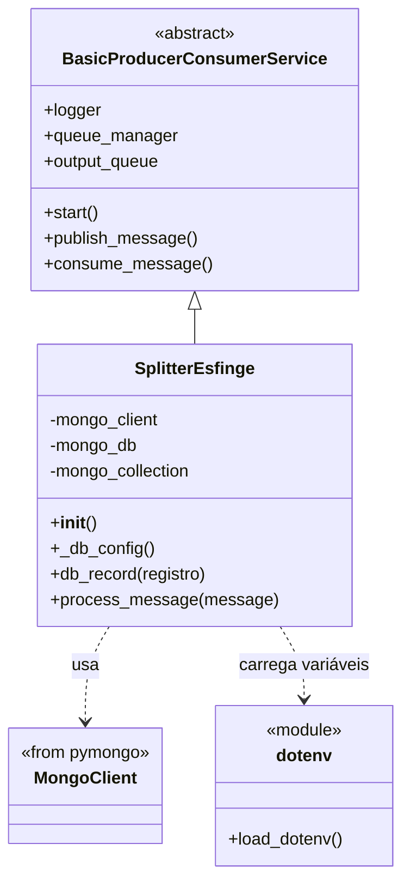

# Splitter e-Sfinge - Projeto CEOS

O splitter `main.py` do módulo **e-Sfinge** é responsável por fatiar o conteúco recebido pelo Collector, transformando 
cada registro bruto em um registro atômico processável. Ele também salva esses registros brutos em um banco de dados de 
documentos que contém todos os registros brutos coletados conforme as regras do fluxo CEOS.

> Esta versão do splitter implementa a persistencia de dados, porém ainda não esta sendo efetivamente utilizada. 
> O id que esta sendo devolvido é gerado apenas para testes.

---

## O que é o Splitter e-Sfinge?

No contexto do projeto **CEOS**, o splitter é um microserviço responsável por **transformar** e **atomizar** os 
dados brutos coletados da fonte e-Sfinge, preparando-os para o processamento posterior.

- Suas responsabilidades incluem:

    - Receber mensagens do `collector` via fila (RabbitMQ), contendo os dados brutos coletados da fonte e-Sfinge.

    - Dividir os registros, convertendo cada entrada da lista recebida em uma unidade atômica de dado.

    - Persistir cada registro individualmente no banco de dados.

    - Encaminhar os registros processados para a fila de saída, destinados ao microserviço Processor.

    - Gerar logs detalhados para monitoramento, rastreabilidade e diagnóstico de falhas.

Esse serviço atua como ponte entre a coleta de dados e a etapa de processamento, garantindo que cada item esteja pronto para análise posterior.

---
## Diagrama de classe SplitterEsfinge

---
## 📁 Estrutura do Projeto

```plaintext
/main-server
│
├── /collector
├── /splitter
│   ├── /pncp            
│   ├── /dom             
│   ├── /notas           
│   └── /esfinge                 ← 🟢 VOCÊ ESTÁ AQUI
│       ├── main.py              
│       ├── requirements.txt     ←  Dependências
│       ├── Dockerfile           ←  Configurações do container
│       ├── env.txt              ←  Exemplo Variáveis de ambiente
│       └── utils.py             ←  Utilitários do coletor
│
├── /triggers
│
└── .env
```
---
## Como executar

1. Assegure-se de que o serviço de filas (RabbitMQ) está em execução.
> As filas devem estar em execução para que o trigger funcione corretamente. Para isso, siga as instruções do [main-server](https://codigos.ufsc.br/ceos/data-ingestion-system/main-server/-/blob/main/README.md?ref_type=heads).
2. Executar o trigger:
```bash
  python trigger-esfinge.py
```
3. Executar o terminal dentro do container do splitter:
```bash
  docker exec -it <container_id> /bin/sh
```
> O `container_id` pode ser obtido com o comando:
>```bash
>  docker ps
>```

---
## Resposta esperada
Ao executar, o serviço irá iniciar o fluxo configurado e exibir uma mensagem indicando o disparo do processo, por exemplo
```plaintext
plitter-esfinge-1            | ################## Splitter Esfinge Iniciado ###############
splitter-esfinge-1            | [2025-07-18 20:24:26] [INFO] Connecting to queues...
splitter-esfinge-1            | [2025-07-18 20:24:26] [INFO] Connecting to RabbitMQ server - rabbitmq:5672
splitter-esfinge-1            | [2025-07-18 20:24:26] [INFO] Connected to RabbitMQ
splitter-esfinge-1            | [2025-07-18 20:24:26] [INFO] Queue 'esfinge_splitter' declared.
splitter-esfinge-1            | [2025-07-18 20:24:26] [INFO] Queue 'esfinge_processor' declared.
processor-esfinge-1           | ################## Processor Esfinge Iniciado ###############
splitter-esfinge-1            | [2025-07-18 20:24:26] [INFO] Queue 'esfinge_splitter_erro' declared.
processor-esfinge-1           | [2025-07-18 20:24:26] [INFO] Connecting to queues...
splitter-esfinge-1            | [2025-07-18 20:24:26] [INFO] Connected to queues successfully.
processor-esfinge-1           | [2025-07-18 20:24:26] [INFO] Connecting to RabbitMQ server - rabbitmq:5672
splitter-esfinge-1            | [2025-07-18 20:24:26] [INFO] Connected to MinIO at minio:9000
processor-esfinge-1           | [2025-07-18 20:24:26] [INFO] Connected to RabbitMQ
splitter-esfinge-1            | [2025-07-18 20:24:26] [INFO] Listening for messages on queue: esfinge_splitter
processor-esfinge-1           | [2025-07-18 20:24:26] [INFO] Queue 'esfinge_processor' declared.
splitter-esfinge-1            | [2025-07-18 20:24:26] [INFO] Started consuming messages from queue 'esfinge_splitter'.
processor-esfinge-1           | [2025-07-18 20:24:26] [INFO] Queue 'esfinge_verifier' declared.
splitter-esfinge-1            | [2025-07-18 20:25:38] [INFO] Received message:...
```

## Formato de mensagem Recebida/Enviada
Recebe uma mensagem com a configuração para a coleta, como por exemplo:
```json

[
  {
    "id inidoneidade": 10000001, 
    "id tipo pessoa": "ENUM", 
    "código cic": 19287841000150, 
    "nome pessoa": "HIGI PLUS DISTRIBUIDORA DE PRODUTOS", 
    "data publicação": "24/04/2017 00:00:00", 
    "data fim prazo": "24/04/2019 00:00:00", 
    "competencia": 201702, 
    "identificador tipo inidoneidade": "ENUM", 
    "raw_data_id": null, 
    "entity_type": "inidoneidade", 
    "data_source": "esfinge"
  }, 
  {
    "id inidoneidade": 10000002, 
    "id tipo pessoa": "ENUM", 
    "código cic": 18761529000193, 
    "nome pessoa": "Neiva Buss Werner ME", 
    "data publicação": "25/04/2017 00:00:00", 
    "data fim prazo": "25/04/2019 00:00:00", 
    "competencia": 201702, 
    "identificador tipo inidoneidade": "ENUM", 
    "raw_data_id": null, 
    "entity_type": "inidoneidade", 
    "data_source": "esfinge"
  }
]
```

```json
{
  "id inidoneidade": 10000001, 
  "id tipo pessoa": "ENUM", 
  "código cic": 19287841000150, 
  "nome pessoa": "HIGI PLUS DISTRIBUIDORA DE PRODUTOS", 
  "data publicação": "24/04/2017 00:00:00", 
  "data fim prazo": "24/04/2019 00:00:00", 
  "competencia": 201702, 
  "identificador tipo inidoneidade": "ENUM", 
  "raw_data_id": "68fd523612c588bf767749a2", 
  "entity_type": "inidoneidade", 
  "data_source": "esfinge", 
  "universal_id": "68fd523612c588bf767749a2"
}

```

---
## Diagrama de Fluxo Simplificado
```plaintext
    ┌────────────┐      ┌──────────────────┐      ┌──────────────┐      ┌────────────────┐      ┌───────────────┐
    │ Scheduler  │ ───► │ trigger.py       │ ───► │ main.py      │ ───► │ Splitter (e.g.)│ ───► │ Fila (Queue)  │
    │ (cronjob)  │      │ (início do fluxo)│      │ (coletor)    │      │ SplitterEsfinge│      │ (Processor)   │
    └────────────┘      └──────────────────┘      └──────────────┘      └────────────────┘      └───────────────┘

```
---
## Contato

Em caso de dúvidas técnicas, procure os responsáveis pela arquitetura CEOS ou consulte a [documentação](https://codigos.ufsc.br/ceos/geral/wiki-ceos) principal do projeto.

[<br><sub>Projeto Céos</sub>](https://ceos.ufsc.br/)