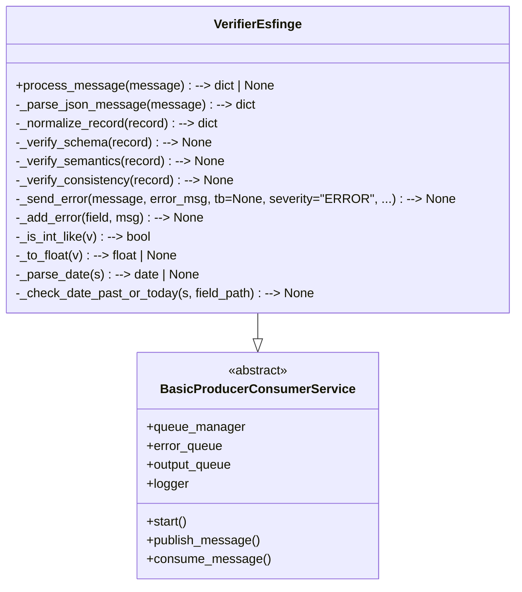

# Verifier Esfinge

O **Verifier** é o módulo responsável por validar e normalizar os dados processados pelo **Processor** antes da sua carga no banco relacional.  
Ele garante que os registros estejam consistentes, padronizados e prontos para armazenamento, tratando campos ausentes, formatos incorretos e valores inválidos.

---

## Funcionamento

O Verifier recebe como entrada registros no formato **JSON hierárquico**, gerados pelo Processor, e realiza:

1. **Preenchimento de campos nulos**  
   - Caso um campo não exista na entrada, ele é atribuído como `null`.  
   - Isso permite que todos os dados sigam o mesmo padrão de saída.

2. **Validação**  
   - Estrutura: Verifica se todas as chaves obrigatórias estão presentes.  
   - Tipagem: Confere se os valores correspondem ao tipo esperado (inteiro, string, data, etc).  
   - Regras de domínio: Campos como **CNPJ**, **CEP**, **datas** e **valores monetários** são verificados quanto ao formato.  

3. **Normalização**  
   - Datas são convertidas para `YYYY-MM-DD`.  
   - Valores monetários são convertidos para formato numérico (`float`).  
   - Strings são **normalizadas** (remoção de espaços extras, caracteres especiais indevidos e padronização de maiúsculas/minúsculas).  

4. **Saída padronizada**  
   - O JSON resultante mantém a mesma estrutura hierárquica de entrada, mas com os dados validados e normalizados.

---
## Diagrama de Classes



---
## Estrutura do Código

- BaseExtractor
    - Classe abstrata com a interface mínima para todos os extractors.

- VerifierEsfinge

    - O Verifier é responsável por realizar a validação e normalização dos dados extraídos no módulo Processor. Ele garante que os registros estejam consistentes e preparados para inserção no banco relacional. Os métodos principais incluem:

- `process_message(message)`  
  Ponto de entrada: recebe a mensagem (JSON), faz parse, normaliza o payload, executa verificações (schema, semântica e consistência) e decide se publica no `output_queue` ou no `fail_queue`. Orquestra todo o fluxo do Verifier.

- `_parse_json_message(message)`  
  Padroniza a mensagem para `dict` (aceitando `bytes`, `str` ou já `dict`). Lança `TypeError` para tipos inesperados.

- `_normalize_record(record)`  
  Garante a presença das tabelas/campos esperados preenchendo faltantes com `None`. Não altera valores existentes, apenas completa a estrutura hierárquica.

- `_verify_schema(record)`  
  Verificações de esquema: presença das tabelas obrigatórias e campos essenciais (ex.: `processo_licitatorio.numero_processo_licitatorio`, `unidade_gestora.nome_ug`, `ente.ente`). Campos ausentes são reportados via `_add_error`.

- `_verify_semantics(record)`  
  Validações semânticas e de formato, usando helpers:
  - datas (`YYYY-MM-DD`) — verifica formato e se não são futuras;
  - números — converte strings numéricas e valida valores (ex.: `valor_total_previsto >= 0`);
  - formatos locais — checagens simples de `CEP` e `CNPJ`;
  - ordenação de datas (ex.: `data_assinatura` ≤ `data_vencimento`).

- `_verify_consistency(record)`  
  Regras de consistência entre tabelas (ex.: se `contrato.valor_contrato` existe, `contrato.numero_contrato` também deve existir; se `processo_licitatorio.id_unidade_gestora` foi informado, espera-se `unidade_gestora.cod_ug`).

- `_add_error(field, msg)`  
  Acumula erros encontrados em `self.errors` (cada entrada contém `field` e `error`).

- `_send_error(message, error_msg, tb=None, severity="ERROR", ...)`  
  Publica um payload de erro padronizado na fila de erros (`error_queue` ou outra fila informada), incluindo timestamp, serviço, stage e traceback.

- Helpers utilitários:
  - `_is_int_like(v)`: verifica se um valor é conversível para inteiro.
  - `_to_float(v)`: tenta converter strings numéricas (aceita vírgula decimal e milhares) para `float`; retorna `None` se inválido.
  - `_parse_date(s)`: converte string `YYYY-MM-DD` para `date` (ou `None`).
  - `_check_date_past_or_today(s, field_path)`: valida se data não é futura e adiciona erro quando inválida.

### Formato de Entrada

Exemplo de registro recebido do Processor:

```json
{
  "ente": {
    "id_municipio": null,
    "id_tipo_esfera": null,
    "ente": "SÃO JOÃO DO OESTE"
  },
  "unidade_gestora": {
    "id_ente": null,
    "nome_ug": "Prefeitura Municipal de São João do Oeste",
    "cnpj": null,
    "id_tipo_ug": null,
    "id_tipo_especificacao_ug": null,
    "jurisdicionado_cn": null,
    "cep": null,
    "orgao_previdencia": null,
    "sigla_ug": null,
    "cod_unidade_consolidadora": null,
    "id_poder": null,
    "cod_ug": 429
  },
  "processo_licitatorio": {
    "id_unidade_gestora": null,
    "numero_edital": "1",
    "situacao": null,
    "id_tipo_cotacao": null,
    "data_abertura_certame": "2019-08-14",
    "descricao_objeto": null,
    "numero_processo_licitatorio": 2042778,
    "id_comissao_licitacao": null,
    "id_unidade_orcamentaria": null,
    "id_tipo_objeto_licitacao": null,
    "valor_total_previsto": "1",
    "data_limite": null
  },
  "modalidade_licitacao": {
    "id_modalidade_licitacao": null
  },
  "contrato": {
    "competencia": null,
    "id_texto_juridico": null,
    "id_processo_licitatorio": null,
    "data_autorizacao_estadual": null,
    "id_resp_juridico": null,
    "data_vencimento": null,
    "id_contrato": null,
    "valor_contrato": null,
    "id_contrato_superior": null,
    "data_assinatura": null,
    "numero_contrato": null,
    "valor_garantia": null,
    "numero_autorizacao_estadual": null,
    "descricao_objetivo": null
  },
  "tipo_licitacao": {
    "id_tipo_licitacao": null,
    "descricao_modalidade": null,
    "descricao": "Maior Lance ou Oferta",
    "modalidade": null
  }
}
```
### Formato de Saída

Após o processamento no Verifier, a saída segue a mesma estrutura hierárquica, porém com:

1. Campos ausentes preenchidos com null.

2. Datas, valores monetários e identificadores validados e normalizados.

3. Strings padronizadas.

Exemplo (campos tratados):

```json
{
  "ente": {
    "id_municipio": null,
    "id_tipo_esfera": null,
    "ente": "São João do Oeste"
  },
  "unidade_gestora": {
    "id_ente": null,
    "nome_ug": "Prefeitura Municipal de São João do Oeste",
    "cnpj": null,
    "id_tipo_ug": null,
    "id_tipo_especificacao_ug": null,
    "jurisdicionado_cn": null,
    "cep": null,
    "orgao_previdencia": null,
    "sigla_ug": null,
    "cod_unidade_consolidadora": null,
    "id_poder": null,
    "cod_ug": 429
  },
  "processo_licitatorio": {
    "id_unidade_gestora": null,
    "numero_edital": "1",
    "situacao": null,
    "id_tipo_cotacao": null,
    "data_abertura_certame": "2019-08-14",
    "descricao_objeto": null,
    "numero_processo_licitatorio": 2042778,
    "id_comissao_licitacao": null,
    "id_unidade_orcamentaria": null,
    "id_tipo_objeto_licitacao": null,
    "valor_total_previsto": 1.0,
    "data_limite": null
  },
  "modalidade_licitacao": {
    "id_modalidade_licitacao": null
  },
  "contrato": {
    "competencia": null,
    "id_texto_juridico": null,
    "id_processo_licitatorio": null,
    "data_autorizacao_estadual": null,
    "id_resp_juridico": null,
    "data_vencimento": null,
    "id_contrato": null,
    "valor_contrato": null,
    "id_contrato_superior": null,
    "data_assinatura": null,
    "numero_contrato": null,
    "valor_garantia": null,
    "numero_autorizacao_estadual": null,
    "descricao_objetivo": null
  },
  "tipo_licitacao": {
    "id_tipo_licitacao": null,
    "descricao_modalidade": null,
    "descricao": "Maior Lance ou Oferta",
    "modalidade": null
  }
}
``` 
Estrutura do Repositório

```plaintext
verifier/
├── Dockerfile
├── requirements.txt
└── main.py
 
```

Conclusão

O Verifier garante consistência, integridade e padronização dos dados antes de sua persistência no banco, sendo um componente essencial no pipeline ETL do CEOS.