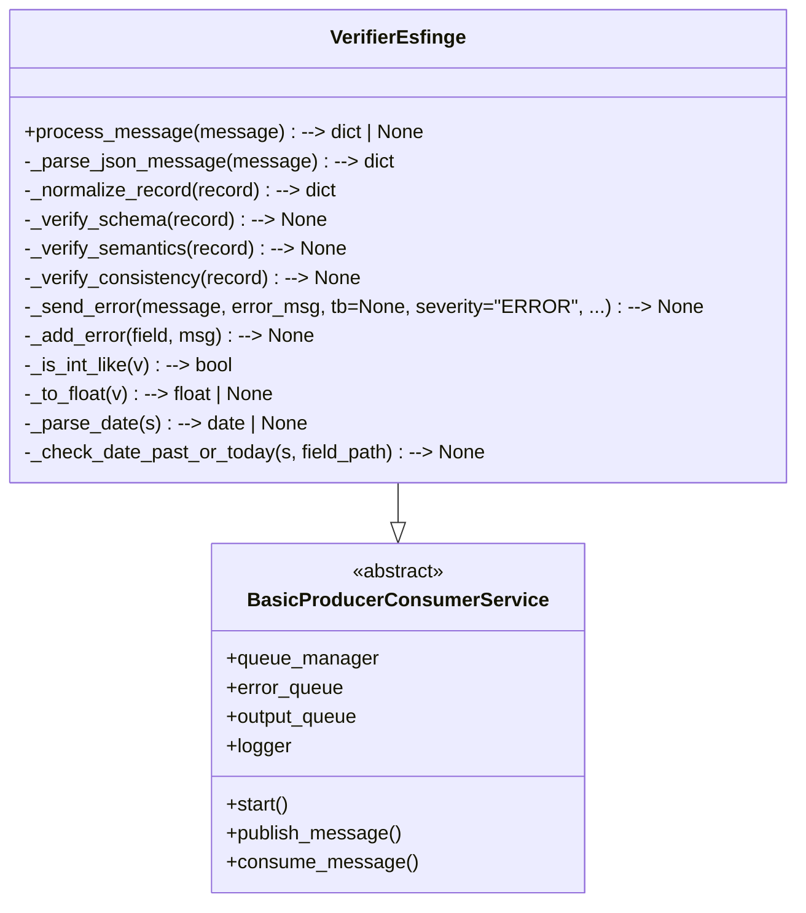

# Verifier Esfinge

O **Verifier** é o módulo responsável por validar e normalizar os dados processados pelo **Processor** antes da sua carga no banco relacional.  
Ele garante que os registros estejam consistentes, padronizados e prontos para armazenamento, tratando campos ausentes, formatos incorretos e valores inválidos.

---

## Funcionamento

O Verifier recebe como entrada registros no formato **JSON hierárquico**, gerados pelo Processor, e realiza:

1. **Preenchimento de campos nulos**  
   - Caso um campo não exista na entrada, ele é atribuído como `null`.  
   - Isso permite que todos os dados sigam o mesmo padrão de saída.

2. **Validação**  
   - Estrutura: Verifica se todas as chaves obrigatórias estão presentes.  
   - Tipagem: Confere se os valores correspondem ao tipo esperado (inteiro, string, data, etc).  
   - Regras de domínio: Campos como **CNPJ**, **CEP**, **datas** e **valores monetários** são verificados quanto ao formato.  

3. **Normalização**  
   - Datas são convertidas para `YYYY-MM-DD`.  
   - Valores monetários são convertidos para formato numérico (`float`).  
   - Strings são **normalizadas** (remoção de espaços extras, caracteres especiais indevidos e padronização de maiúsculas/minúsculas).  

4. **Saída padronizada**  
   - O JSON resultante mantém a mesma estrutura hierárquica de entrada, mas com os dados validados e normalizados.

---
## Diagrama de Classes



---
## Estrutura do Código

- BaseExtractor
    - Classe abstrata com a interface mínima para todos os extractors.

- VerifierEsfinge

    - O Verifier é responsável por realizar a validação e normalização dos dados extraídos no módulo Processor. Ele garante que os registros estejam consistentes e preparados para inserção no banco relacional. Os métodos principais incluem:

- `process_message(message)`  
  Ponto de entrada: recebe a mensagem (JSON), faz parse, normaliza o payload, executa verificações (schema, semântica e consistência) e decide se publica no `output_queue` ou no `fail_queue`. Orquestra todo o fluxo do Verifier.

- `_parse_json_message(message)`  
  Padroniza a mensagem para `dict` (aceitando `bytes`, `str` ou já `dict`). Lança `TypeError` para tipos inesperados.

- `_normalize_record(record)`  
  Garante a presença das tabelas/campos esperados preenchendo faltantes com `None`. Não altera valores existentes, apenas completa a estrutura hierárquica.

- `_verify_schema(record)`  
  Verificações de esquema: presença das tabelas obrigatórias e campos essenciais (ex.: `processo_licitatorio.numero_processo_licitatorio`, `unidade_gestora.nome_ug`, `ente.ente`). Campos ausentes são reportados via `_add_error`.

- `_verify_semantics(record)`  
  Validações semânticas e de formato, usando helpers:
  - datas (`YYYY-MM-DD`) — verifica formato e se não são futuras;
  - números — converte strings numéricas e valida valores (ex.: `valor_total_previsto >= 0`);
  - formatos locais — checagens simples de `CEP` e `CNPJ`;
  - ordenação de datas (ex.: `data_assinatura` ≤ `data_vencimento`).

- `_verify_consistency(record)`  
  Regras de consistência entre tabelas (ex.: se `contrato.valor_contrato` existe, `contrato.numero_contrato` também deve existir; se `processo_licitatorio.id_unidade_gestora` foi informado, espera-se `unidade_gestora.cod_ug`).

- `_add_error(field, msg)`  
  Acumula erros encontrados em `self.errors` (cada entrada contém `field` e `error`).

- `_send_error(message, error_msg, tb=None, severity="ERROR", ...)`  
  Publica um payload de erro padronizado na fila de erros (`error_queue` ou outra fila informada), incluindo timestamp, serviço, stage e traceback.

- Helpers utilitários:
  - `_is_int_like(v)`: verifica se um valor é conversível para inteiro.
  - `_to_float(v)`: tenta converter strings numéricas (aceita vírgula decimal e milhares) para `float`; retorna `None` se inválido.
  - `_parse_date(s)`: converte string `YYYY-MM-DD` para `date` (ou `None`).
  - `_check_date_past_or_today(s, field_path)`: valida se data não é futura e adiciona erro quando inválida.

### Formato de Entrada

Exemplo de registro recebido do Processor:

```json
{
    "pagamento_empenho": {
        "id_subempenho_pagamento_empenho": null,
        "cod_banco": null,
        "data_publicacao_justificativa": null,
        "id_tipo_recurso_antecipado": null,
        "data_validade": null,
        "data_exigibilidade": null,
        "id_empenho": null,
        "competencia": 201702,
        "nro_conta_bancaria_pagadora": null,
        "nro_ordem_bancaria": null,
        "id_liquidacao": null,
        "valor_pagamento": null,
        "data_pagamento": null,
        "id_pagamento_empenho": null,
        "cod_agencia": null
    },
    "unidade_orcamentaria": {
        "id_unidade_orcamentaria": null,
        "nome_unidade_orcamentaria": null,
        "cod_unidade_orcamentaria": null
    },
    "item_licitacao": {
        "descricao_item_licitacao": null,
        "numero_sequencial_item": null,
        "descricao_unidade_medida": null,
        "tipo_item": null,
        "situacao_item": null,
        "valor_estimado_item": null,
        "qtd_item_licitacao": null,
        "id_processo_licitatorio": null,
        "id_item_licitacao": null,
        "competencia": 201702,
        "data_homologacao": null,
        "numero_lote": null
    },
    "empenho": {
        "prestacao_contas": null,
        "descricao_historico_empenho": null,
        "detalhamento_fonte_recurso": null,
        "id_categoria_economica_despesa": null,
        "id_subempenho": null,
        "numero_licitacao": null,
        "valor_empenho": null,
        "id_indicador_uso": null,
        "id_detalhamento_destinacao_recurso": null,
        "id_elemento_despesa": null,
        "numero_convenio": null,
        "id_unidade_orcamentaria": null,
        "id_grupo_natureza_despesa": null,
        "id_processo_licitatorio": null,
        "id_unidade_gestora": null,
        "data_empenho": null,
        "id_empenho": null,
        "id_detalhamento_elemento_despesa": null,
        "id_tipo_pessoa": null,
        "id_modalidade_aplicacao": null,
        "id_sub_empenho": null,
        "competencia": null,
        "regularizacao_orcamentaria": null,
        "id_grupo_fontes_recursos": null,
        "id_tipo_acao": null,
        "num_empenho": null,
        "numero_convenio_superior": null,
        "id_especificacao_fonte_recurso": null,
        "id_tipo_empenho": null,
        "credor": null,
        "numero_projeto_atividade": null
    },
    "contrato": {
        "numero_contrato_superior": null,
        "numero_contrato": null,
        "data_autorizacao_estadual": null,
        "nome_resp_juridico_contrato": null,
        "codigo_cic_contratado": null,
        "data_vencimento": null,
        "competencia": 201702,
        "id_texto_juridico": null,
        "id_contrato": null,
        "numero_licitacao_contrato": null,
        "valor_contrato": null,
        "id_contrato_superior": null,
        "data_assinatura": null,
        "id_processo_licitatorio": null,
        "valor_garantia": null,
        "numero_autorizacao_estadual": null,
        "descricao_objetivo": null,
        "nome_contratado": null,
        "id_tipo_pessoa_contrato": null,
        "id_unidade_gestora": null
    },
    "pessoa": {
        "cnpj_cpf_credor": null,
        "nome_resp_juridico_convenio": null,
        "cpf_regoeiro": null,
        "nome_responsavel_juridico": null,
        "nome": "HIGI PLUS DISTRIBUIDORA DE PRODUTOS",
        "nome_resp_juridico_contrato": null
    },
    "estorno_liquidacao": {
        "competencia": 201702,
        "data_estorno_liquidacao": null,
        "id_liquidacao": null,
        "valor_estornoliquidacao": null,
        "descricaomotivo": null,
        "id_estornoliquidacao": null
    },
    "convenio": {
        "data_assinatura_convenio": null,
        "id_texto_juridico_convenio": null,
        "id_convenio_superior": null,
        "data_fim_vigencia": null,
        "descricao_objeto_convenio": null,
        "data_autorizacao_executivo": null,
        "valor_convenio_": null,
        "id_convenio": null,
        "competencia_convenio": 201702,
        "id_tipo_convenio": null,
        "id_unidade_gestora_Convenio": null
    },
    "ente": {
        "id_municipio": null,
        "id_tipo_esfera": null,
        "ente": null,
        "id_ente": null
    },
    "participante_convenio": {
        "codigo_cic_participante": null,
        "id_participante_convenio": null,
        "id_tipo_participacao_convenio": null,
        "id_convenio": null,
        "valor_participacao": null,
        "percentual_participacao": null,
        "competencia": 201702,
        "nome_participante": null,
        "cnpj_participante": null
    },
    "comissao_licitacao": {
        "id_comissaolicitacao": null,
        "id_tipo_comissao_equipe_apoio": null,
        "competencia": 201702,
        "nro_sequencial": null,
        "data_designacao_comissao": null,
        "data_fim_prazo_designacao": null,
        "descricao_finalidade": null
    },
    "unidade_gestora": {
        "nome_ug": null,
        "id_ente": null,
        "cnpj": null,
        "id_tipo_ug": null,
        "id_tipo_especificacao_ug": null,
        "jurisdicionado_cn": null,
        "cep": null,
        "orgao_previdencia": null,
        "sigla_ug": null,
        "cod_unidade_consolidadora": null,
        "id_poder": null,
        "cod_ug": null,
        "id_unidade_gestora": null
    },
    "reforco_empenho": {
        "numeroreforco": null,
        "competencia": 201702,
        "id_empenho": null,
        "descricaomotivoreforco": null,
        "id_reforcoempenho": null,
        "valor_reforco": null,
        "data_reforco": null
    },
    "estorno_subempenho": {
        "nro_estorno_subempenho": null,
        "id_subempenho": null,
        "id_estornosubempenho": null,
        "descricao_motivo_estorno_subempenho": null,
        "competencia": 201702,
        "data_estorno": null,
        "valor_estorno_subempenho": null
    },
    "liquidacao": {
        "id_subempenho": null,
        "valor_liquidacao": null,
        "data_liquidacao": null,
        "nota_liquidacao": null,
        "id_empenho": null,
        "competencia": 201702,
        "id_liquidacao": null
    },
    "processo_licitatorio": {
        "data_aprovacao_acessoria_juridica": null,
        "parecer_juridico_favoravel?": null,
        "numero_edital": null,
        "ambito_internacional?": null,
        "id_situacao_processo_licitatorio": null,
        "valor_garantia_proposta": null,
        "data_planilha_custos": null,
        "id_modalidade_licitacao": null,
        "id_tipo_cotacao": null,
        "descrição_orgao_ref_preco": null,
        "registro_preco?": null,
        "data_abertura_certame": null,
        "data_homologacao_pregoeiro": null,
        "competencia": 201702,
        "id_texto_juridico": null,
        "data_pesquisa": null,
        "descricao_objeto": null,
        "numero_processo_licitatorio": null,
        "id_comissao_licitacao": null,
        "id_unidade_orcamentaria": null,
        "id_processo_licitatorio": null,
        "data_homologacao": null,
        "id_tipo_objeto_licitacao": null,
        "valor_total_previsto": null,
        "id_tipo_licitacao": null,
        "data_limite": null,
        "identificado_responsavel": null,
        "id_unidade_gestora": null
    },
    "cotacao": {
        "valor_cotado": null,
        "numero_item": null,
        "id_cotacao": null,
        "id_item_licitacao": null,
        "id_pessoa": null,
        "vencedor": null,
        "qt_item_cotado": null,
        "competencia": 201702,
        "classificacao": null
    },
    "participante_licitacao": {
        "id_participantelicitacao": null,
        "id_tipopessoa": "ENUM",
        "id_participantelicitacaocotacao": null,
        "competencia": 201702,
        "codigocnpjconsorcio": null,
        "id_procedimentolictatorio": null,
        "data_validadeproposta": null,
        "nomeparticipante": null,
        "id_participantelicitacao2": null,
        "codigocicparticipante": null,
        "participante_cotacao": null,
        "cpf_cnpj_participante_cotacao": null
    },
    "membro_comissao_licitacao": {
        "data_fim_designacao": null,
        "id_comissaolicitacao": null,
        "id_membrocomissao": null,
        "competencia": 201702,
        "presidencia": null,
        "numero_portaria_designacao": null,
        "nome_membro": null,
        "data_homologacao_pregoeiro_orgao_estadual": null,
        "cpf_membro": null,
        "data_inicio_designacao": null
    },
    "subempenho": {
        "id_subempenho": null,
        "descricao_historico_subempenho": null,
        "data_emissao": null,
        "competencia": 201702,
        "id_empenho": null,
        "numerosubempenho": null,
        "valor_subempenho": null
    },
    "convidado_licitacao": {
        "data_recebimento_convite": null,
        "codigo_cic": 19287841000150,
        "competencia": 201702,
        "nome_convidado": null,
        "id_procedimentolictatorio": null,
        "id_convidadolicitacao": null,
        "id_tipo_pessoa": "ENUM"
    },
    "bloqueio_orcamentario": {
        "id_bloqueioorcamentario": null,
        "valor_bloqueado": null,
        "data_bloqueio": null,
        "numero_sequencial": null
    },
    "inidonea": {
        "id_tipo_inidoneidade": "ENUM",
        "id_inidonea": 10000001,
        "data_validade": "24/04/2019 00:00:00",
        "codigo_cic": 19287841000150,
        "id_pessoa": "ENUM",
        "competencia": 201702,
        "data_publicacao": "24/04/2017 00:00:00"
    },
    "estorno_pagamento": {
        "id_pagamentoempenho": null,
        "data_estorno_pagamento": null,
        "competencia": 201702,
        "valor_estornopagamento": null,
        "id_estornopagamento": null
    },
    "modalidade_licitacao": {
        "id_modalidade_licitacao": null,
        "descricao": null
    },
    "tipo_licitacao": {
        "descricao": null,
        "descricao_modalidade": null,
        "modalidade": null,
        "id_tipo_licitacao": null
    },
    "estorno_empenho": {
        "data_estorno_empenho": null,
        "id_estornoempenho": null,
        "competencia": 201702,
        "valor_estorno": null,
        "id_empenho": null,
        "nro_estorno": null,
        "descricao_motivo_estorno_empenho": null
    },
    "entity_type": "inidoneidade",
    "data_source": "esfinge",
    "raw_data_id": "68fd5a10dbcb2b83616e988c",
    "extra_fields": {
        "id inidoneidade": 10000001,
        "id tipo pessoa": "ENUM",
        "código cic": 19287841000150,
        "nome pessoa": "HIGI PLUS DISTRIBUIDORA DE PRODUTOS",
        "data publicação": "24/04/2017 00:00:00",
        "data fim prazo": "24/04/2019 00:00:00",
        "identificador tipo inidoneidade": "ENUM",
        "universal_id": "68fd5a10dbcb2b83616e988c"
    }
}
```
### Formato de Saída

Após o processamento no Verifier, a saída segue a mesma estrutura hierárquica, porém com:

1. Campos ausentes preenchidos com null.

2. Datas, valores monetários e identificadores validados e normalizados.

3. Strings padronizadas.

Exemplo (campos tratados):

```json
{
    "pagamento_empenho": {
        "competencia": 201702
    },
    "item_licitacao": {
        "competencia": 201702
    },
    "contrato": {
        "competencia": 201702
    },
    "pessoa": {
        "nome": "HIGI PLUS DISTRIBUIDORA DE PRODUTOS"
    },
    "estorno_liquidacao": {
        "competencia": 201702
    },
    "convenio": {
        "competencia_convenio": 201702
    },
    "participante_convenio": {
        "competencia": 201702
    },
    "comissao_licitacao": {
        "competencia": 201702
    },
    "reforco_empenho": {
        "competencia": 201702
    },
    "estorno_subempenho": {
        "competencia": 201702
    },
    "liquidacao": {
        "competencia": 201702
    },
    "processo_licitatorio": {
        "competencia": 201702
    },
    "cotacao": {
        "competencia": 201702
    },
    "participante_licitacao": {
        "id_tipopessoa": "ENUM",
        "competencia": 201702
    },
    "membro_comissao_licitacao": {
        "competencia": 201702
    },
    "subempenho": {
        "competencia": 201702
    },
    "convidado_licitacao": {
        "codigo_cic": 19287841000150,
        "competencia": 201702,
        "id_tipo_pessoa": "ENUM"
    },
    "inidonea": {
        "id_tipo_inidoneidade": "ENUM",
        "id_inidonea": 10000001,
        "data_validade": "2019-04-24",
        "codigo_cic": 19287841000150,
        "id_pessoa": "ENUM",
        "competencia": 201702,
        "data_publicacao": "2017-04-24"
    },
    "estorno_pagamento": {
        "competencia": 201702
    },
    "estorno_empenho": {
        "competencia": 201702
    },
    "entity_type": "inidoneidade",
    "raw_data_id": "68fd5b53dbcb2b83616e98af",
    "data_source": "esfinge",
    "extra_fields": {
        "id inidoneidade": 10000001,
        "id tipo pessoa": "ENUM",
        "código cic": 19287841000150,
        "nome pessoa": "HIGI PLUS DISTRIBUIDORA DE PRODUTOS",
        "data publicação": "2017-04-24",
        "data fim prazo": "2019-04-24",
        "identificador tipo inidoneidade": "ENUM",
        "universal_id": "68fd5b53dbcb2b83616e98af"
    }
}
``` 
Estrutura do Repositório

```plaintext
verifier/
├── Dockerfile
├── requirements.txt
└── main.py          # Verifier principal (consome SchemaMonitor)
│── schemaWatcher.py    # Classe especializada para monitoramento
│── configs/
    └── schema.yml       # Schema externo de referência
 
```

Conclusão

O Verifier garante consistência, integridade e padronização dos dados antes de sua persistência no banco, sendo um componente essencial no pipeline ETL do CEOS.